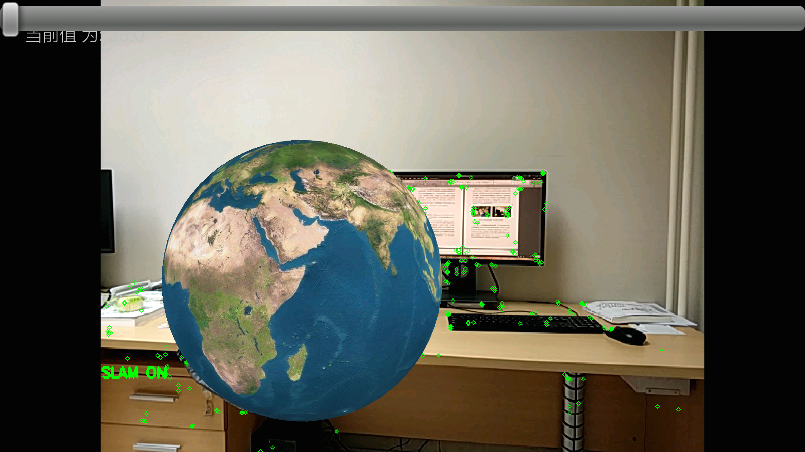
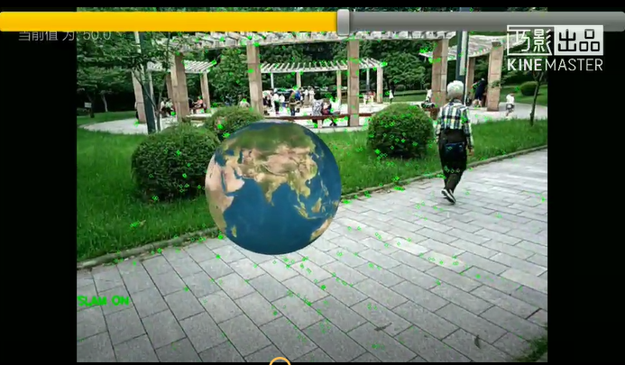
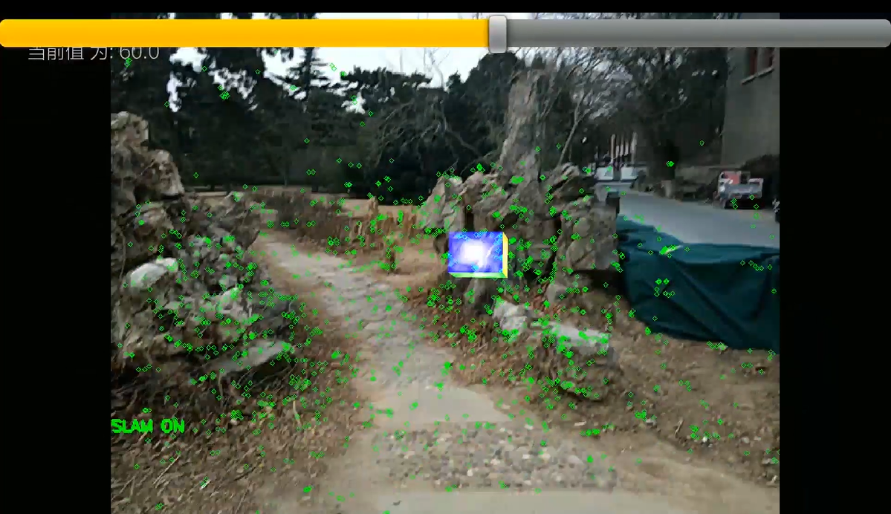

# ORB-SLAM2-based-AR-on-Android
## Introduction
This is a Android Augmented Reality APP based on [ORB-SLAM2](https://github.com/raulmur/ORB_SLAM2) and OpenGL. The demo video can be found in the links below.


**demo  videos** 

&nbsp;&nbsp;&nbsp;&nbsp;&nbsp;&nbsp;&nbsp;&nbsp;&nbsp;&nbsp;&nbsp;&nbsp;
<a href="http://player.youku.com/embed/XMzU0NjY5OTAyOA==" target="_blank"></a>

&nbsp;&nbsp;&nbsp;&nbsp;&nbsp;&nbsp;
<embed src='http://player.youku.com/player.php/sid/XMzYzNTE4Nzg0MA==/v.swf' allowFullScreen='true' quality='high' width='480' height='400' align='middle' allowScriptAccess='always' type='application/x-shockwave-flash'></embed>
<a href="http://player.youku.com/embed/XMzU0NjY5OTAyOA==" target="_blank"></a>

&nbsp;&nbsp;&nbsp;&nbsp;&nbsp;&nbsp;
<a href="http://player.youku.com/embed/XMzU0NjcwNjI0OA==" target="_blank"></a>


## Dependencies & Installation & Usage 
To run this APP you need to copy the *./SLAM* folder into your mobile phones, which contains the vocabulary file(ORBvoc.bin) and camera Calibration file(mi6.yaml). Then you need to change the 20th row in the *./app/src/main/cpp/native-lib.cpp* to configure the correct path in your phone. You may also need to calibrate your phone's camera for better performance. More details of camera calibration can be found on google.

```cpp
ORB_SLAM2::System SLAM("/storage/emulated/0/SLAM/VOC/ORBvoc.bin","/storage/emulated/0/SLAM/Calibration/mi6.yaml",ORB_SLAM2::System::MONOCULAR,false);

```

Due to the project is based on ORB-SLAM2, OpenCV4Androi is needed. Other third part dependence like g2o, Eigen, DBoW2 are all included in the project. As for the IDE, Android studio 2.5 or higher version is recommended.


To compile the project you may need to edit some configurations in the ***CMakeLists.txt*** file, which is in the path */app/CMakeLists.txt* 


Due to the diversity of Android system version, I am not sure weather my configuration can work well on other Android devices. So you may also need to change some configurarions in the ***AndroidManifest.xml*** to make sure that the app have the authority to use the camera and file system.

## Framework & Results
The system is consisted of two parts, the ORB-SLAM2 part is ported from [FireStoneYS' profile](https://github.com/FireStoneYS/ORB_SLAM2_Android), which is used to get the camera's pose matrix. The other part is the OpenGL Rendering module, which use the pose matrix to render the 3D object(the earth in this project).


The ORB-SLAM2 system requires lots of computing resources, So this APP can only achieve nearly 10 fps on the MI6 with a snapdragon 835 CPU. 
